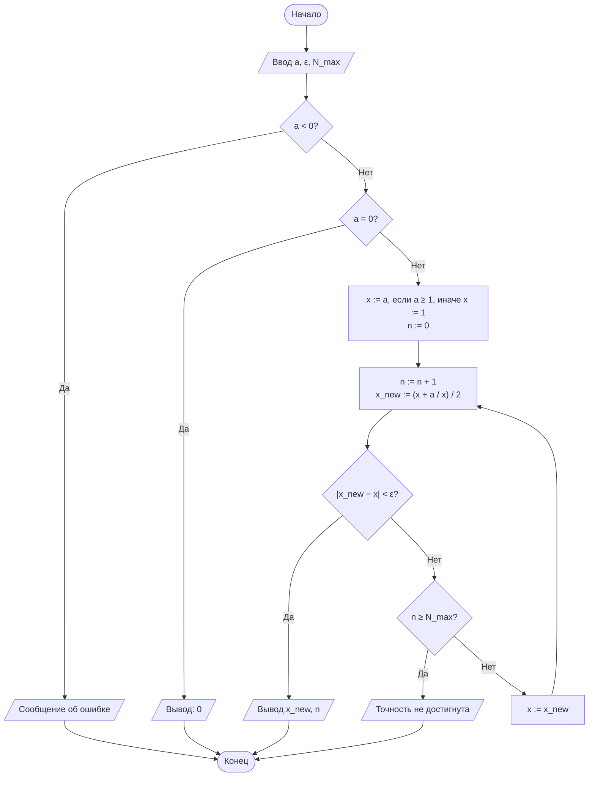
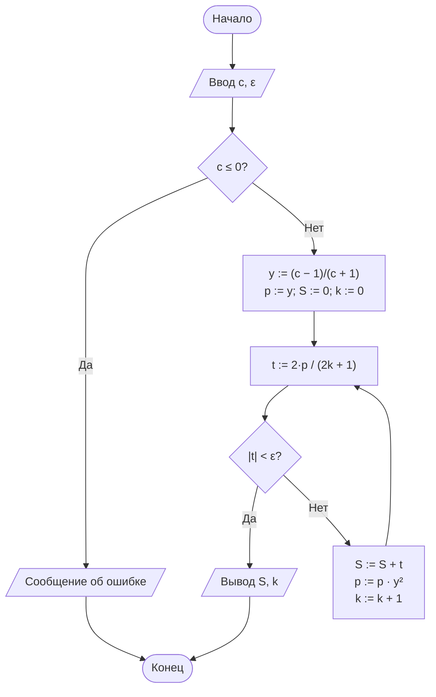

# Лабораторная работа № 1

## Итерационные методы вычисления элементарных функций: квадратный корень, кубический корень и натуральный логарифм

**Дисциплина:** Теория алгоритмов
**Направление подготовки:** 38.03.05 «Бизнес-информатика»
**Курс:** 2
**Объём:** 4 академических часа
**Язык реализации:** Python 3.10+

---

## 1. Цель и задачи работы

**Цель работы:** сформировать у обучающихся представление об итерационных алгоритмах как о классе вычислительных процедур, результат которых достигается последовательным уточнением приближений, и освоить приёмы оценки их сходимости и трудоёмкости.

**Задачи:**

1. Изучить понятия итерационного процесса, начального приближения, критерия остановки и скорости сходимости.
2. Реализовать алгоритмы вычисления $\sqrt{a}$ и $\sqrt[3]{b}$ методом Ньютона, а также $\ln c$ методом разложения в степенной ряд.
3. Экспериментально определить число итераций, необходимое для достижения заданной точности $\varepsilon$.
4. Сравнить полученные значения с эталонными значениями стандартной библиотеки (`math`) и оценить абсолютную погрешность.

---

## 2. Теоретическая часть

### 2.1. Понятие итерационного алгоритма

*Итерационным* называется алгоритм, в котором искомая величина $x^*$ получается как предел последовательности приближений

$$x_0,\ x_1,\ x_2,\ \ldots,\ x_n,\ \ldots,$$

где каждое следующее приближение вычисляется по предыдущему с помощью фиксированного правила (*итерационной формулы*):

$$x_{n+1} = \varphi(x_n).$$

Любой итерационный алгоритм определяется тремя элементами:

| Элемент | Содержание |
|---|---|
| Начальное приближение $x_0$ | Стартовое значение, от которого зависит число итераций, а иногда и сама сходимость |
| Итерационная формула $\varphi$ | Правило перехода от $x_n$ к $x_{n+1}$ |
| Критерий остановки | Условие, при выполнении которого вычисления прекращаются |

На практике используют следующие критерии остановки:

- **по разности соседних приближений:** $\lvert x_{n+1} - x_n \rvert < \varepsilon$;
- **по невязке:** $\lvert F(x_n) \rvert < \varepsilon$, где $F(x) = 0$ — решаемое уравнение (например, $F(x) = x^2 - a$);
- **по предельному числу итераций** $N_{\max}$, который служит страховкой от зацикливания при отсутствии сходимости.

С точки зрения теории алгоритмов важно, что итерационный процесс, в отличие от классического алгоритма, в общем случае не обязан завершаться за конечное число шагов. Свойство *результативности* обеспечивается именно критерием остановки. Этот аспект подробно обсуждается в работах Д. Кнута и Н. Вирта [1, 2].

### 2.2. Скорость сходимости

Пусть $e_n = \lvert x_n - x^* \rvert$ — погрешность на $n$-м шаге. Говорят, что процесс сходится с порядком $p$, если

$$e_{n+1} \approx C \cdot e_n^{\,p}.$$

- При $p = 1$ (линейная сходимость) число верных знаков растёт на постоянную величину за итерацию.
- При $p = 2$ (квадратичная сходимость) число верных знаков **примерно удваивается** на каждой итерации.

Метод Ньютона при удачном выборе $x_0$ обладает квадратичной сходимостью. Поэтому для точности $\varepsilon = 10^{-6}$ ему обычно достаточно 4–8 итераций [3, 4].

### 2.3. Метод Ньютона (метод касательных)

Для решения уравнения $F(x) = 0$ метод Ньютона строит последовательность

$$x_{n+1} = x_n - \frac{F(x_n)}{F'(x_n)}.$$

Геометрически $x_{n+1}$ — это точка пересечения касательной к графику $F(x)$ в точке $x_n$ с осью абсцисс.

**Квадратный корень.** Положим $F(x) = x^2 - a$, тогда $F'(x) = 2x$ и

$$x_{n+1} = \frac{1}{2}\left(x_n + \frac{a}{x_n}\right).$$

Эта формула известна со времён античности как **формула Герона**. Для $a > 0$ и любого $x_0 > 0$ последовательность сходится к $\sqrt{a}$. Начиная с первой итерации она монотонно убывает.

**Кубический корень.** Положим $F(x) = x^3 - b$, тогда $F'(x) = 3x^2$ и

$$x_{n+1} = \frac{1}{3}\left(2x_n + \frac{b}{x_n^2}\right).$$

Для отрицательного $b$ используется тождество $\sqrt[3]{b} = -\sqrt[3]{\lvert b \rvert}$. Метод применяется к модулю числа, а знак восстанавливается в конце.

**Выбор начального приближения.** Простая эвристика: $x_0 = a$ при $a \ge 1$ и $x_0 = 1$ при $0 < a < 1$. Неудачный выбор $x_0$ (например, очень большое значение) не нарушает сходимости для рассматриваемых функций, но увеличивает число итераций.

### 2.4. Вычисление натурального логарифма с помощью ряда

Классический ряд Тейлора $\ln(1 + x) = x - \frac{x^2}{2} + \frac{x^3}{3} - \ldots$ сходится только при $-1 < x \le 1$, и притом медленно. Поэтому на практике применяют преобразованный ряд:

$$\ln c = 2\left(y + \frac{y^3}{3} + \frac{y^5}{5} + \frac{y^7}{7} + \ldots\right), \qquad y = \frac{c-1}{c+1}.$$

Для любого $c > 0$ выполняется $\lvert y \rvert < 1$, поэтому ряд сходится при всех положительных аргументах. Вычисление ведётся **итеративно**: каждый следующий член получается из предыдущего умножением степени на $y^2$:

$$t_k = \frac{2\,y^{2k+1}}{2k+1}.$$

Суммирование прекращается, когда $\lvert t_k \rvert < \varepsilon$.

**Нормализация аргумента.** При $c \gg 1$ или $c \ll 1$ значение $\lvert y \rvert$ близко к единице, и ряд сходится медленно. Для ускорения аргумент представляют в виде

$$c = m \cdot 2^k, \qquad m \in [0{,}5;\ 1),$$

и вычисляют $\ln c = \ln m + k \ln 2$. Оба логарифма в правой части считаются по тому же ряду, но при $\lvert y \rvert \le 1/3$, то есть значительно быстрее.

### 2.5. Трудоёмкость

Трудоёмкость итерационного алгоритма оценивается числом итераций $N(\varepsilon)$, необходимым для достижения точности $\varepsilon$:

| Метод | Порядок сходимости | Оценка $N(\varepsilon)$ |
|---|---|---|
| Метод Ньютона (квадратный и кубический корни) | 2 | $O(\log\log(1/\varepsilon))$ |
| Ряд для ln (без нормализации) | 1 | $O\left(\log(1/\varepsilon) \,/\, \log(1/\lvert y \rvert)\right)$ |
| Метод половинного деления (для сравнения) | 1 | $O(\log_2((b - a)/\varepsilon))$ |

---

## 3. Порядок выполнения работы

1. Изучить теоретическую часть и рекомендуемую литературу.
2. Построить блок-схемы алгоритмов вычисления $\sqrt{a}$, $\sqrt[3]{b}$ и $\ln c$.
3. Реализовать алгоритмы в виде отдельных функций на языке Python. **Не использовать** `math.sqrt`, `math.log`, `**0.5` и аналоги внутри вычислительных функций; допускается их применение только для получения эталонных значений.
4. Каждая функция должна возвращать пару «результат, число итераций».
5. Выполнить расчёты для исходных данных своего варианта (табл. 1) и дополнительного требования (табл. 2).
6. Сравнить результаты с эталоном и заполнить таблицу результатов.
7. Оформить отчёт и ответить на контрольные вопросы.

---

## 4. Варианты заданий

**Обозначения в табл. 1:**

- **Критерий:** Р — по разности соседних приближений, Н — по невязке ($\lvert x^2 - a \rvert < \varepsilon$ для корня; для логарифма всегда используется критерий по модулю члена ряда);
- **$x_0$:** способ выбора начального приближения для методов Ньютона;
- **Доп.:** номер дополнительного требования из табл. 2.

**Таблица 1. Исходные данные**

| № | $a$ для $\sqrt{a}$ | $b$ для $\sqrt[3]{b}$ | $c$ для $\ln c$ | $\varepsilon$ | Критерий | $x_0$ | Доп. |
|---|---|---|---|---|---|---|---|
| 0 | 2 | 10 | 5 | $10^{-6}$ | Р | $a$ или $1$ | — |
| 1 | 3 | 7 | 2 | $10^{-4}$ | Р | $x_0 = a$ | Д1 |
| 2 | 5 | 12 | 3 | $10^{-5}$ | Н | $x_0 = a/2$ | Д2 |
| 3 | 7 | −8 | 0,5 | $10^{-6}$ | Р | $x_0 = 1$ | Д6 |
| 4 | 0,25 | 15 | 10 | $10^{-4}$ | Н | $x_0 = 1$ | Д3 |
| 5 | 11 | 20 | 1,5 | $10^{-7}$ | Р | $x_0 = a$ | Д5 |
| 6 | 13 | −27 | 7 | $10^{-5}$ | Р | $x_0 = a/2$ | Д1 |
| 7 | 17 | 30 | 0,1 | $10^{-6}$ | Н | $x_0 = a$ | Д4 |
| 8 | 0,5 | 45 | 20 | $10^{-5}$ | Р | $x_0 = 1$ | Д3 |
| 9 | 19 | 50 | 4 | $10^{-8}$ | Н | $x_0 = a/2$ | Д2 |
| 10 | 23 | −64 | 0,75 | $10^{-6}$ | Р | $x_0 = a$ | Д6 |
| 11 | 29 | 70 | 50 | $10^{-4}$ | Р | $x_0 = 1$ | Д3 |
| 12 | 0,09 | 81 | 9 | $10^{-7}$ | Н | $x_0 = 1$ | Д5 |
| 13 | 31 | 100 | 0,2 | $10^{-5}$ | Р | $x_0 = a/2$ | Д1 |
| 14 | 37 | −125 | 12 | $10^{-6}$ | Н | $x_0 = a$ | Д4 |
| 15 | 41 | 150 | 100 | $10^{-5}$ | Р | $x_0 = a$ | Д3 |
| 16 | 43 | 200 | 2,5 | $10^{-8}$ | Р | $x_0 = 1$ | Д2 |
| 17 | 0,8 | −216 | 0,05 | $10^{-6}$ | Н | $x_0 = 1$ | Д6 |
| 18 | 47 | 250 | 15 | $10^{-7}$ | Р | $x_0 = a/2$ | Д5 |
| 19 | 53 | 300 | 6 | $10^{-4}$ | Н | $x_0 = a$ | Д1 |
| 20 | 59 | −343 | 0,3 | $10^{-6}$ | Р | $x_0 = a$ | Д4 |
| 21 | 61 | 400 | 200 | $10^{-5}$ | Р | $x_0 = 1$ | Д3 |
| 22 | 0,02 | 500 | 8 | $10^{-7}$ | Н | $x_0 = 1$ | Д2 |
| 23 | 67 | −512 | 0,9 | $10^{-6}$ | Р | $x_0 = a/2$ | Д6 |
| 24 | 71 | 600 | 30 | $10^{-8}$ | Н | $x_0 = a$ | Д5 |
| 25 | 73 | 729 | 1,1 | $10^{-5}$ | Р | $x_0 = a$ | Д1 |
| 26 | 79 | −800 | 500 | $10^{-6}$ | Р | $x_0 = 1$ | Д3 |
| 27 | 83 | 900 | 3,5 | $10^{-7}$ | Н | $x_0 = a/2$ | Д4 |
| 28 | 0,3 | 1000 | 0,01 | $10^{-6}$ | Р | $x_0 = 1$ | Д6 |
| 29 | 97 | −1331 | 25 | $10^{-5}$ | Н | $x_0 = a$ | Д2 |
| 30 | 1000 | 2000 | 1000 | $10^{-8}$ | Р | $x_0 = a$ | Д5 |

**Таблица 2. Дополнительные требования**

| Код | Содержание требования |
|---|---|
| Д1 | Вывести таблицу итераций для каждой функции: номер шага, $x_n$, $\lvert x_{n+1} - x_n \rvert$. Проанализировать, как меняется число верных знаков от шага к шагу |
| Д2 | Сравнить три способа выбора $x_0$ ($x_0 = a$, $x_0 = a/2$, $x_0 = 1$) по числу итераций. Результаты оформить таблицей |
| Д3 | Реализовать вычисление $\ln c$ с нормализацией аргумента ($c = m \cdot 2^k$). Сравнить число итераций с ненормализованным вариантом |
| Д4 | Ввести ограничение $N_{\max} = 5$. Реализовать корректное завершение с диагностическим сообщением, если точность не достигнута. Определить минимальное $N_{\max}$, достаточное для своего варианта |
| Д5 | Построить график зависимости числа итераций от точности $\varepsilon \in \{10^{-1}, 10^{-2}, \ldots, 10^{-10}\}$ для всех трёх функций (логарифмическая шкала по оси $\varepsilon$) |
| Д6 | Реализовать проверку корректности входных данных ($a < 0$, $c \le 0$, нечисловой ввод) с выводом понятных сообщений пользователю. Продемонстрировать работу на ошибочных данных |

---

## 5. Требования к отчёту

Отчёт должен содержать:

1. Титульный лист.
2. Цель работы и формулировку задания своего варианта.
3. Краткие теоретические сведения: итерационные формулы с пояснениями.
4. Блок-схемы алгоритмов (ГОСТ 19.701-90 или нотация Mermaid/draw.io).
5. Листинг программы с комментариями.
6. Результаты расчётов в виде таблицы и, при необходимости, графики.
7. Анализ результатов и выводы.

---

## 6. Пример оформления отчёта (вариант 0)

### 6.1. Задание

Вычислить $\sqrt{2}$, $\sqrt[3]{10}$ и $\ln 5$ с точностью $\varepsilon = 10^{-6}$. Критерий остановки для корней — по разности соседних приближений. Начальное приближение: $x_0 = a$ при $a \ge 1$, иначе $x_0 = 1$.

### 6.2. Блок-схема алгоритма вычисления квадратного корня



### 6.3. Блок-схема алгоритма вычисления натурального логарифма



Блок-схема для $\sqrt[3]{b}$ строится аналогично схеме для $\sqrt{a}$. Отличия: блок обработки знака в начале, итерационная формула $x_{\text{new}} := (2x + b/x^2)/3$ и восстановление знака перед выводом.

### 6.4. Листинг программы

```python
"""
Лабораторная работа № 1. Вариант 0.
Итерационные методы вычисления √a, ∛b, ln c.
"""
import math

EPS = 1e-6
N_MAX = 100


def sqrt_newton(a, eps=EPS, n_max=N_MAX):
    """Квадратный корень методом Ньютона (формула Герона)."""
    if a < 0:
        raise ValueError("Подкоренное выражение должно быть неотрицательным")
    if a == 0:
        return 0.0, 0
    x = a if a >= 1 else 1.0
    for n in range(1, n_max + 1):
        x_new = 0.5 * (x + a / x)
        if abs(x_new - x) < eps:
            return x_new, n
        x = x_new
    raise RuntimeError("Точность не достигнута за N_MAX итераций")


def cbrt_newton(b, eps=EPS, n_max=N_MAX):
    """Кубический корень методом Ньютона (с учётом знака)."""
    if b == 0:
        return 0.0, 0
    sign = -1 if b < 0 else 1
    b = abs(b)
    x = b if b >= 1 else 1.0
    for n in range(1, n_max + 1):
        x_new = (2 * x + b / (x * x)) / 3
        if abs(x_new - x) < eps:
            return sign * x_new, n
        x = x_new
    raise RuntimeError("Точность не достигнута за N_MAX итераций")


def ln_series(c, eps=EPS, n_max=10_000):
    """Натуральный логарифм через ряд ln((1+y)/(1-y)), y=(c-1)/(c+1)."""
    if c <= 0:
        raise ValueError("Аргумент логарифма должен быть положительным")
    y = (c - 1) / (c + 1)
    y2 = y * y
    power = y          # текущая степень y^(2k+1)
    total = 0.0
    for k in range(n_max):
        term = 2 * power / (2 * k + 1)
        if abs(term) < eps:
            return total, k
        total += term
        power *= y2
    raise RuntimeError("Точность не достигнута за n_max итераций")


if __name__ == "__main__":
    a, b, c = 2, 10, 5
    print(f"{'Функция':<10}{'Аргумент':>10}{'Результат':>16}"
          f"{'Эталон':>16}{'Погрешность':>14}{'Итераций':>10}")
    for name, f, arg, ref in [("sqrt", sqrt_newton, a, math.sqrt(a)),
                              ("cbrt", cbrt_newton, b, b ** (1 / 3)),
                              ("ln", ln_series, c, math.log(c))]:
        val, n = f(arg)
        print(f"{name:<10}{arg:>10}{val:>16.10f}{ref:>16.10f}"
              f"{abs(val - ref):>14.2e}{n:>10}")
```

### 6.5. Результаты

**Таблица 3. Результаты вычислений (вариант 0, $\varepsilon = 10^{-6}$)**

| Функция | Аргумент | Результат | Эталон (`math`) | Абс. погрешность | Число итераций |
|---|---|---|---|---|---|
| $\sqrt{a}$ | 2 | 1,4142135624 | 1,4142135624 | $2{,}22 \cdot 10^{-16}$ | 5 |
| $\sqrt[3]{b}$ | 10 | 2,1544346900 | 2,1544346900 | $9{,}33 \cdot 10^{-15}$ | 8 |
| $\ln c$ | 5 | 1,6094369872 | 1,6094379124 | $9{,}25 \cdot 10^{-7}$ | 14 |

### 6.6. Анализ результатов и выводы (образец)

1. Все три алгоритма достигли заданной точности $\varepsilon = 10^{-6}$. Фактическая погрешность методов Ньютона оказалась на много порядков меньше $\varepsilon$ ($\approx 10^{-15}$). Это объясняется квадратичной сходимостью: к моменту выполнения критерия по разности погрешность уже пренебрежимо мала.
2. Для $\sqrt[3]{10}$ потребовалось больше итераций, чем для $\sqrt{2}$. Причина — более удалённое начальное приближение ($x_0 = 10$ при $x^* \approx 2{,}15$): на первых шагах метод сходится практически линейно, а квадратичный режим наступает лишь вблизи корня.
3. Разложение в ряд для $\ln 5$ ($\lvert y \rvert = 2/3$) сходится линейно: 14 членов ряда. Погрешность того же порядка, что и $\varepsilon$. Это характерно для процессов первого порядка.
4. Для повышения эффективности вычисления логарифма больших аргументов целесообразно применять нормализацию $c = m \cdot 2^k$ (см. требование Д3).

---

## 7. Контрольные вопросы

1. Дайте определение итерационного алгоритма. Какими свойствами алгоритма (дискретность, детерминированность, результативность, массовость) он обладает и как обеспечивается результативность?
2. Выведите итерационную формулу Герона из метода Ньютона.
3. Чем отличаются критерии остановки «по разности» и «по невязке»? В каких случаях они могут давать разные результаты?
4. Что такое порядок сходимости? Почему метод Ньютона сходится быстрее метода половинного деления?
5. Как влияет выбор начального приближения на число итераций? Приведите пример из собственных расчётов.
6. Почему ряд $\ln(1 + x)$ не подходит для вычисления $\ln 100$, а ряд с $y = (c - 1)/(c + 1)$ подходит?
7. В чём смысл нормализации аргумента $c = m \cdot 2^k$?
8. Почему фактическая погрешность может быть значительно меньше $\varepsilon$? Может ли она оказаться больше $\varepsilon$?
9. Зачем в итерационном алгоритме нужно ограничение $N_{\max}$?
10. Приведите пример задачи из экономики или бизнес-аналитики, решаемой итерационно (например, расчёт внутренней нормы доходности IRR).

---

## 8. Рекомендуемая литература

1. Кнут Д. Э. Искусство программирования. Т. 1. Основные алгоритмы. — 3-е изд. — М.: Вильямс, 2017.
2. Вирт Н. Алгоритмы и структуры данных. Новая версия для Оберона. — М.: ДМК Пресс, 2016.
3. Вержбицкий В. М. Основы численных методов. — М.: Высшая школа, 2009.
4. Бахвалов Н. С., Жидков Н. П., Кобельков Г. М. Численные методы. — 9-е изд. — М.: Лаборатория знаний, 2020.
5. Кормен Т., Лейзерсон Ч., Ривест Р., Штайн К. Алгоритмы: построение и анализ. — 3-е изд. — М.: Вильямс, 2013.
6. Бхаргава А. Грокаем алгоритмы. Иллюстрированное пособие для программистов и любопытствующих. — 2-е изд. — СПб.: Питер, 2024.
7. ГОСТ 19.701-90 (ИСО 5807-85). ЕСПД. Схемы алгоритмов, программ, данных и систем. Условные обозначения и правила выполнения.
