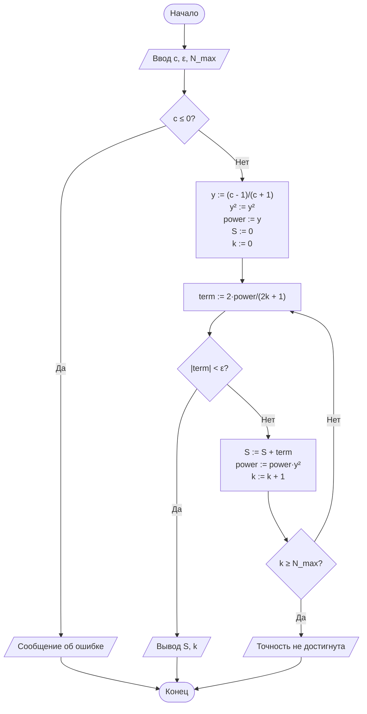

# Блок-схема: вычисление ln(c)

```mermaid
flowchart TD
    A([Начало]) --> B[/Ввод c, ε, N_max/]
    B --> C{c ≤ 0?}
    C -- Да --> D[/Сообщение об ошибке/] --> Z([Конец])
    C -- Нет --> E["y := (c - 1)/(c + 1)<br/>y² := y²<br/>power := y<br/>S := 0<br/>k := 0"]
    E --> F["term := 2·power/(2k + 1)"]
    F --> G{"|term| < ε?"}
    G -- Да --> H[/Вывод S, k/] --> Z
    G -- Нет --> I["S := S + term<br/>power := power·y²<br/>k := k + 1"]
    I --> J{"k ≥ N_max?"}
    J -- Да --> K[/Точность не достигнута/] --> Z
    J -- Нет --> F
```
