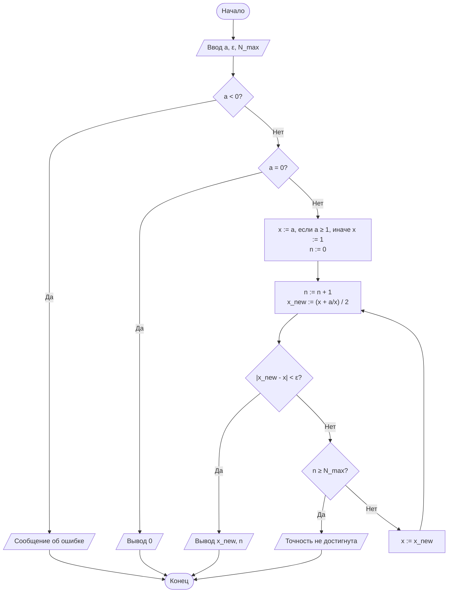

# Блок-схема: вычисление √a

```mermaid
flowchart TD
    A([Начало]) --> B[/Ввод a, ε, N_max/]
    B --> C{a < 0?}
    C -- Да --> D[/Сообщение об ошибке/] --> Z([Конец])
    C -- Нет --> E{a = 0?}
    E -- Да --> F[/Вывод 0/] --> Z
    E -- Нет --> G["x := a, если a ≥ 1, иначе x := 1<br/>n := 0"]
    G --> H["n := n + 1<br/>x_new := (x + a/x) / 2"]
    H --> I{"|x_new - x| < ε?"}
    I -- Да --> J[/Вывод x_new, n/] --> Z
    I -- Нет --> K{"n ≥ N_max?"}
    K -- Да --> L[/Точность не достигнута/] --> Z
    K -- Нет --> M["x := x_new"] --> H
```
