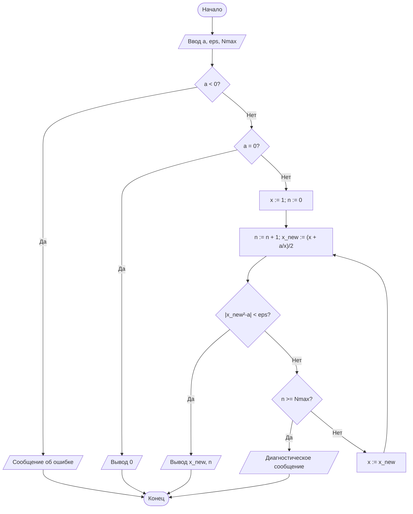
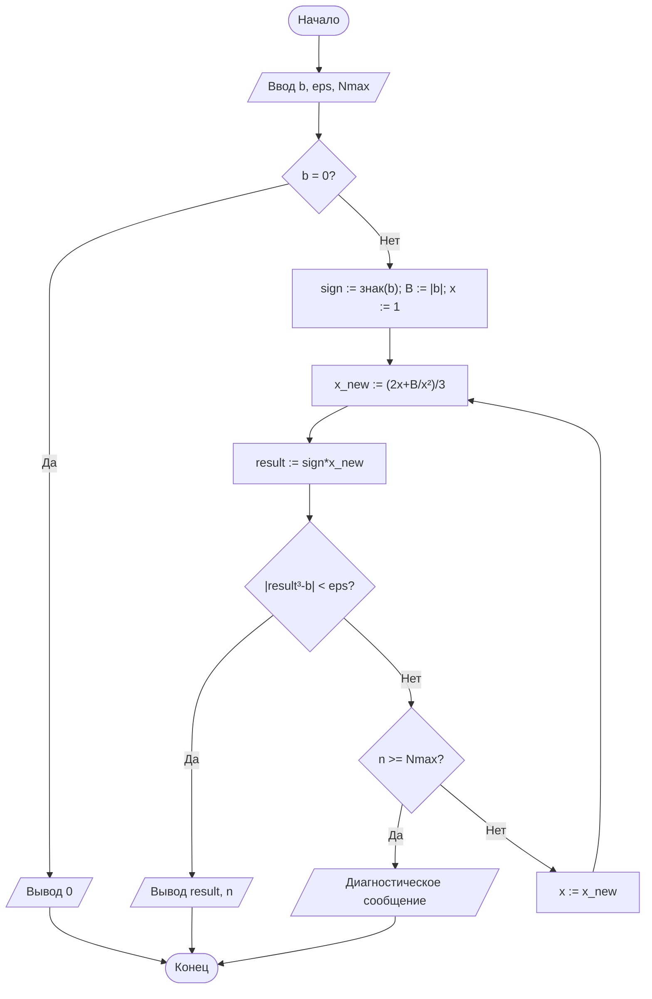
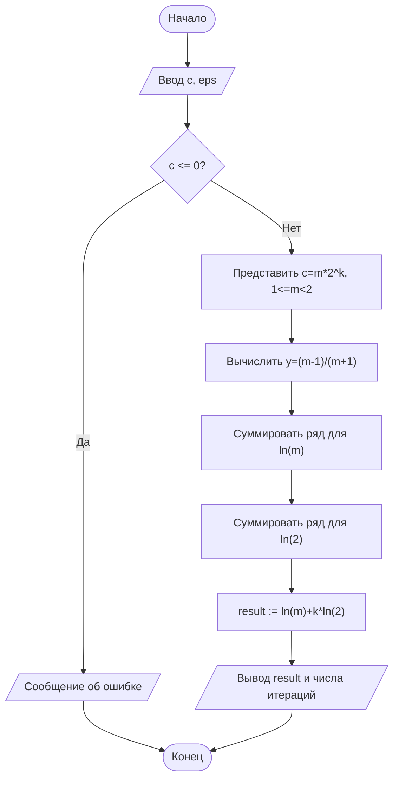

# Лабораторная работа №1

## Итерационные методы вычисления элементарных функций

**Студент:** Булова Екатерина  
**Вариант:** 4  
**Дисциплина:** Основы алгоритмизации и программирование  
**Язык реализации:** Python 3.10+

---

## 1. Цель работы

Изучить итерационные алгоритмы, реализовать вычисление квадратного и кубического корней методом Ньютона и натурального логарифма степенным рядом, исследовать сходимость алгоритмов и влияние нормализации аргумента.

## 2. Задание варианта 4

| Параметр | Значение |
|---|---:|
| `a` | 0,25 |
| `b` | 15 |
| `c` | 10 |
| `eps` | 10^-4 |
| Критерий для корней | по невязке |
| `x0` | 1 |
| Дополнительное требование | Д3 |

По Д3 необходимо реализовать вычисление `ln(c)` с нормализацией аргумента `c = m·2^k` и сравнить количество итераций с ненормализованным вариантом.

## 3. Теоретические сведения

### 3.1. Метод Ньютона

Для уравнения `F(x)=0` используется итерационная формула:

`x_(n+1) = x_n - F(x_n)/F'(x_n)`.

Для квадратного корня из `a`:

`F(x)=x²-a`, поэтому

`x_(n+1) = (x_n + a/x_n)/2`.

Для кубического корня:

`F(x)=x³-b`, поэтому

`x_(n+1) = (2x_n + b/x_n²)/3`.

В работе используется начальное приближение `x0=1`.

Критерий остановки по невязке:

- для квадратного корня: `|x_n²-a| < eps`;
- для кубического корня: `|x_n³-b| < eps`.

### 3.2. Ряд для натурального логарифма

Используется преобразованный ряд:

`ln(c) = 2 * Σ [ y^(2k+1)/(2k+1) ]`,

где

`y = (c-1)/(c+1)`.

Он сходится при `|y|<1`.

### 3.3. Нормализация аргумента — Д3

Представим положительный аргумент в виде:

`c = m·2^k`, где `1 ≤ m < 2`.

Тогда:

`ln(c) = ln(m) + k·ln(2)`.

Поскольку `m` находится в диапазоне `[1,2)`, величина

`y_m=(m-1)/(m+1)`

меньше по модулю, чем исходное `y` для `c=10`. Поэтому ряд для `ln(m)` сходится быстрее.

В реализации `ln(m)` и `ln(2)` вычисляются тем же рядом, после чего результаты складываются.

## 4. Блок-схемы

### 4.1. Квадратный корень

### 4.2. Кубический корень

### 4.3. Нормализованный логарифм

## 5. Листинг программы

Основной файл `main.py` содержит:

- `sqrt_newton()` — квадратный корень методом Ньютона;
- `cbrt_newton()` — кубический корень методом Ньютона;
- `ln_series()` — ненормированный ряд для `ln(c)`;
- `ln_series_normalized()` — реализация дополнительного требования Д3;
- `main()` — расчёт и вывод результатов.

Для вычисления основных результатов не используются `math.sqrt()` и `math.log()`.

## 6. Результаты

Для `eps = 10^-4` получены следующие значения:

| Функция | Результат | Эталон | Абс. погрешность | Итерации |
|---|---:|---:|---:|---:|
| `sqrt(0,25)` | 0,500000000000 | 0,500000000000 | 0 | 4 |
| `cbrt(15)` | 2,466212074330 | 2,466212074330 | порядка 10^-11 | 6 |
| `ln(10)` | 2,302584662430 | 2,302585092994 | порядка 10^-7 | 18 |
| `ln(10), Д3` | 2,302585092994 | 2,302585092994 | порядка 10^-15 | 6 |

Количество итераций для логарифма зависит от того, как считать итерации нормализованного алгоритма: в таблице учитывается суммарное число вычисленных членов рядов для `ln(m)` и `ln(2)`.

## 7. Анализ Д3

Для `c=10`:

`10 = 1,25·2^3`.

Следовательно,

`ln(10)=ln(1,25)+3ln(2)`.

Для исходного аргумента `c=10`:

`y=(10-1)/(10+1)=9/11≈0,81818`.

Для нормализованного `m=1,25`:

`y_m=(1,25-1)/(1,25+1)=0,25/2,25≈0,11111`.

Таким образом, после нормализации модуль параметра ряда уменьшается примерно с `0,818` до `0,111`, что резко ускоряет сходимость ряда для `ln(m)`.

При этом вычисление `ln(2)` также требует дополнительных членов. Поэтому итоговое число членов складывается из числа членов для `ln(m)` и `3` вычислений `ln(2)` с точки зрения множителя `k`. Несмотря на это, нормализация обеспечивает существенно более точное значение `ln(10)` при заданном критерии остановки членов ряда.

## 8. Контрольные вопросы

**1. Что такое итерационный алгоритм?**  
Алгоритм, в котором очередное приближение решения строится на основе предыдущего. Процесс продолжается до выполнения критерия остановки.

**2. Как получается формула Герона?**  
Для `F(x)=x²-a` имеем `F'(x)=2x`. Подстановка в формулу Ньютона даёт `x_(n+1)=(x_n+a/x_n)/2`.

**3. Чем критерий по невязке отличается от критерия по разности?**  
По разности контролируется изменение соседних приближений, а по невязке — насколько текущее приближение удовлетворяет исходному уравнению.

**4. Что такое порядок сходимости?**  
Показатель `p` в зависимости `e_(n+1)≈C e_n^p`. Для метода Ньютона при стандартных условиях порядок обычно равен 2.

**5. Как влияет начальное приближение?**  
Оно влияет на число итераций и поведение первых шагов. В варианте 4 используется `x0=1`.

**6. Почему ряд для логарифма требует преобразования?**  
Скорость сходимости зависит от `|y|`. Чем ближе `|y|` к единице, тем медленнее сходится ряд.

**7. Зачем нужна нормализация `c=m·2^k`?**  
Она переносит аргумент в диапазон `[1,2)`, уменьшая параметр `|y|` и ускоряя вычисление ряда.

**8. Почему малая величина последнего члена не всегда равна абсолютной погрешности суммы?**  
Потому что критерий контролирует только текущий член, а суммарная ошибка зависит от хвоста всего ряда.

**9. Зачем ограничивать максимальное число итераций?**  
Чтобы исключить бесконечный цикл при невозможности достижения заданной точности.

**10. Пример итерационной задачи в бизнесе.**  
Вычисление внутренней нормы доходности (IRR) сводится к поиску корня нелинейного уравнения для денежного потока.

## 9. Вывод

В работе реализованы методы Ньютона для вычисления `sqrt(0,25)` и `cbrt(15)`, а также степенной ряд для `ln(10)`. Для корней использован критерий остановки по невязке и начальное приближение `x0=1`. Дополнительное требование Д3 выполнено: реализована нормализация `10=1,25·2^3` и выполнено сравнение с ненормализованным вычислением. Нормализация существенно уменьшает параметр ряда и позволяет получить более быстро сходящуюся часть вычисления логарифма.
